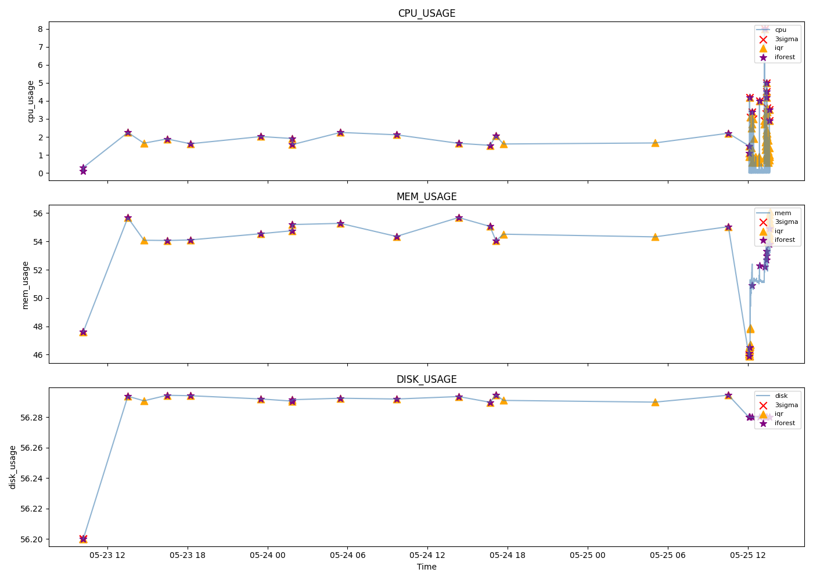

# SRE 异常检测报告
> 生成时间: 2026-05-26 01:58:40

## 数据概况
- 总点数: 515
- 时间范围: 2026-05-23 10:10:45 ~ 2026-05-25 13:40:07

## 三种算法对比(异常率仅统计CPU)
| 算法 | 异常数 | 异常率 |
|------|--------|--------|
| 3-Sigma | 15 | 2.91% |
| IQR | 75 | 14.56% |
| Isolation Forest | 26 | 5.05% |
## 可视化
